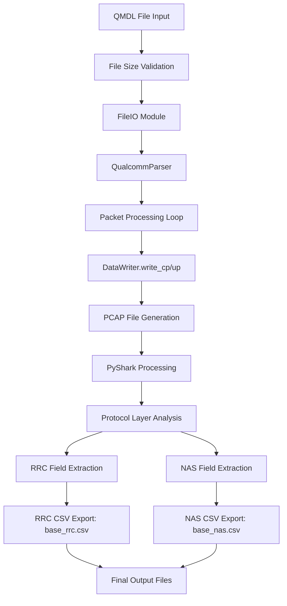

# Mobile Observation and Diagnostic Interface Parser Module

## Overview

The **Mobile Observation and Diagnostic Interface Parser Module** is a specialized parser module designed for the Mobile Observation and Diagnostic Interface (MODI) application. This module serves as the core processing engine for gathering and parsing network signals from LTE and 5G cellular networks directly from the rooted android mobile device.

### Purpose

This parser module converts raw network capture data from mobile devices into structured, analyzable formats. It processes Qualcomm Diagnostics Logs (QMDL) and Packet Capture (PCAP) files to extract detailed signaling information for network analysis, diagnostics, and security research. QMDL files are typically captured from mobile devices using Qualcomm diagnostic tools.

### Key Capabilities

- **Multi-format Input Processing**: Handles both QMDL and PCAP files
- **Advanced Protocol Dissection**: Supports LTE, NR (5G), NAS, and GSM protocols
- **Structured Data Export**: Generates separate RRC and NAS CSV files with normalized headers
- **PyShark Integration**: Leverages Wireshark's industry-standard protocol dissectors
- **Research-Ready Output**: Provides detailed field analysis for academic and security research

### Target Audience

- Mobile network researchers and analysts
- Security researchers studying cellular network protocols
- Network diagnostics professionals
- Academic institutions conducting mobile network research
- Mobile application developers working with network data

## Process Flow

### Data Collection to Analysis Pipeline

The parser module follows a comprehensive pipeline for processing mobile network data:

#### Stage 1: Data Collection

```
Mobile Device → Qualcomm Diagnostics Tools → QMDL File Generation
                                      ↓
                              Raw Network Capture Data
                                      (QMDL Format)
```

#### Stage 2: Initial Processing

```
QMDL File → FileIO Module → QualcommParser → GSMTAP PCAP Generation
                    ↓
          Structured Packet Data (GSMTAP Encapsulated)
```

#### Stage 3: Protocol Dissection

```
GSMTAP PCAP → PyShark → Wireshark Dissectors → Field Extraction
                    ↓
        Protocol-Specific Field Analysis (RRC/NAS/GSM)
```

#### Stage 4: Data Export

```
Extracted Fields → CSV Writer → Normalized Headers → Final Output
                    ↓
        analysis_rrc.csv + analysis_nas.csv + capture.pcap
```

### Detailed Processing Flow

#### QMDL to CSV Processing Flow



#### Key Processing Components

- **FileIO**: Handles QMDL file reading and HDLC frame unwrapping
- **QualcommParser**: Parses Qualcomm-specific diagnostics data
- **DataWriter**: Manages packet writing and CSV generation
- **PyShark**: Interfaces with Wireshark's tshark for protocol dissection
- **CSV Writers**: Generate normalized output files with consistent headers

## Quick Start

## Setup Guide

### Prerequisites Installation

#### 1. System Requirements

- **Operating System**: Linux, macOS, or Windows
- **Python**: Version 3.7 or higher
- **Wireshark**: Version 3.0 or higher (for protocol dissectors)
- **Memory**: 8GB RAM minimum, 16GB recommended for large files
- **Storage**: Sufficient space for input files and generated outputs

#### 2. Python Environment Setup

```bash
# Create virtual environment
python3 -m venv venv

# Activate virtual environment
source venv/bin/activate  # Linux/macOS
# OR
venv\Scripts\activate     # Windows

# Upgrade pip
pip install --upgrade pip
```

#### 3. Install Dependencies

```bash
# Install required packages
pip install pyshark bitstring pyusb pyserial packaging

# Optional: Install additional packages for extended functionality
pip install libscrc  # For additional CRC calculations
```

#### 4. Wireshark Installation

```bash
# Linux (Ubuntu/Debian)
sudo apt update
sudo apt install wireshark tshark

# macOS (using Homebrew)
brew install wireshark

# Windows: Download from https://www.wireshark.org/download.html
# Ensure tshark.exe is in your PATH
```

### Verification

```bash
# Verify installations
python3 --version
tshark --version
pip list | grep pyshark
```

## Dependencies

### Core Dependencies

- **Python 3.7+**: Runtime environment
- **PyShark**: Wireshark/tshark Python interface for packet analysis
- **Bitstring**: Binary data manipulation and parsing
- **PyUSB**: USB device communication
- **PySerial**: Serial port communication
- **Packaging**: Python package version handling

### System Dependencies

- **Wireshark/tshark**: Protocol dissection engine
- **GSMTAP Plugin**: For mobile network protocol support
- **LTE/5G Dissectors**: Built into Wireshark 3.0+

### Optional Dependencies

- **libscrc**: Enhanced CRC calculation support
- **numpy/pandas**: For advanced data analysis (if extending the module)

## Commands and Usage

### Command Line Interface

The parser module provides a comprehensive command-line interface for processing network capture data:

```bash
python3 qmdl_reader.py [OPTIONS] input_file
```

### Available Commands

#### Primary Processing Commands

**Process QMDL file with full analysis:**

```bash
python3 qmdl_reader.py diag_log.qmdl -c analysis -p capture.pcap
# Creates: analysis_rrc.csv, analysis_nas.csv, capture.pcap
```

**Process PCAP file for CSV analysis:**

```bash
python3 qmdl_reader.py capture.pcap -c output
# Creates: output_rrc.csv, output_nas.csv
```

**Generate PCAP only (no CSV analysis):**

```bash
python3 qmdl_reader.py diag_log.qmdl -p output.pcap
# Creates: output.pcap
```

#### Advanced Processing Commands

**Process with custom size threshold:**

```bash
python3 qmdl_reader.py large_file.qmdl -c output -s 50
# Accepts files 50MB and larger
```

**Process multiple files (batch mode):**

```bash
for file in *.qmdl; do
    python3 qmdl_reader.py "$file" -c "output_$(basename "$file" .qmdl)"
done
```

### Command Line Options

| Option | Long Form     | Description                                               | Default        |
| ------ | ------------- | --------------------------------------------------------- | -------------- |
| `-h`   | `--help`      | Show help message and exit                                | -              |
| `-c`   | `--csv BASE`  | Output CSV base path (creates BASE_rrc.csv, BASE_nas.csv) | None           |
| `-p`   | `--pcap FILE` | Output PCAP file path                                     | Auto-generated |
| `-s`   | `--size MB`   | Minimum file size in MB for QMDL files                    | 10             |

**Notes:**

- The `-c` parameter specifies a base path/filename that will be used to generate two separate CSV files
- If `-p` is not specified, a PCAP file will still be auto-generated using the same base name as the CSV files
- The minimum file size check (`-s`) only applies to QMDL files, not PCAP files

## Expected Inputs and Outputs

### Input Formats

#### QMDL Files (Primary Input)

- **Format**: Qualcomm Diagnostics Log
- **Extension**: `.qmdl`, `.QMDL`
- **Minimum Size**: 10MB (configurable with `-s` flag)
- **Content**: Raw cellular network signaling data captured from mobile devices
- **Source**: Generated by Qualcomm diagnostic tools on mobile devices (typically rooted Android devices)
- **Purpose**: Contains complete cellular protocol traces for offline analysis

#### PCAP Files (Secondary Input)

- **Format**: Packet Capture (standard)
- **Extension**: `.pcap`, `.pcapng`
- **Content**: GSMTAP-encapsulated cellular packets or standard network packets
- **Source**: Network capture tools, Wireshark, or converted QMDL files from this parser
- **Purpose**: Analyze already-processed cellular data or standard network captures

### Output Formats

#### CSV Files (Primary Output)

**RRC CSV (`<base>_rrc.csv`)**:

- **Purpose**: Radio Resource Control layer analysis
- **Protocols**: LTE RRC, NR RRC
- **Headers**: Normalized field names (e.g., `lte.rrc.field_name`)
- **Content**: Control plane signaling data

**NAS CSV (`<base>_nas.csv`)**:

- **Purpose**: Non-Access Stratum layer analysis
- **Protocols**: LTE NAS, NR NAS, GSM A-interface
- **Headers**: Normalized field names (e.g., `lte.nas.field_name`)
- **Content**: Session management and mobility data

#### PCAP Files (Secondary Output)

- **Format**: GSMTAP-encapsulated packets
- **Compatibility**: Wireshark, tcpdump, and other network analyzers
- **Purpose**: Further analysis with specialized tools
- **Content**: All processed packets with timing information

### Output File Structure

```
output_directory/
├── analysis_rrc.csv     # RRC layer data
├── analysis_nas.csv     # NAS layer data
└── analysis.pcap        # GSMTAP packet capture
```

### Sample Output Structure

**RRC CSV Headers (actual format from sample file):**

```csv
packet_number,nested_protocol,message_type,channel_type,direction,gsmtap.antenna,gsmtap.arfcn,gsmtap.frame_nr,lte_rrc.,lte_rrc.lte_rrc_accessstratumrelease,lte_rrc.lte_rrc_accumulationenabled,...
4,-1,rrcConnectionRelease,DL-DCCH-Message,downlink,Antenna Number: 0,..00 1110 0101 0010 = ARFCN: 3666,GSM Frame Number: 3776,Header Length: 16 bytes,-1,-1,-1,...
5,-1,MasterInformationBlock,BCCH-BCH-Message,-1,Antenna Number: 0,..00 1110 0101 0010 = ARFCN: 3666,GSM Frame Number: 0,Header Length: 16 bytes,-1,-1,-1,...
```

**NAS CSV Headers (actual format from sample file):**

```csv
packet_number,nested_protocol,message_type,channel_type,direction,gsmtap.antenna,gsmtap.arfcn,gsmtap.frame_nr,nas_eps.,nas_eps.3gpp_tmsi,nas_eps.emm_detach_type_ul,...
1,-1,NAS EPS Mobility Management Message Type: Detach request (0x45),Uplink,uplink,Antenna Number: 0,..00 0000 0000 0000 = ARFCN: 0,GSM Frame Number: 0,EPS mobile identity,TMSI/P-TMSI/M-TMSI/5G-TMSI: 3221226142 (0xc000029e),.... .011 = Detach Type: Combined EPS/IMSI detach (3),...
9,-1,NAS EPS Mobility Management Message Type: Attach request (0x41),"Extraneous Data, dissector bug or later version spec(report to wireshark.org)",-1,Antenna Number: 0,..00 0000 0000 0000 = ARFCN: 0,GSM Frame Number: 0,EPS mobile identity,TMSI/P-TMSI/M-TMSI/5G-TMSI: 3221226142 (0xc000029e),-1,...
```

## Key Features

### ✅ Multi-Format Input Processing

- **QMDL Support**: Native Qualcomm diagnostics log processing
- **PCAP Support**: Standard packet capture file analysis
- **Unified Pipeline**: Consistent processing regardless of input format

### ✅ Advanced Protocol Dissection

- **LTE RRC**: Radio Resource Control for 4G networks
- **NR RRC**: Radio Resource Control for 5G networks
- **NAS Layer**: Non-Access Stratum protocols
- **GSM Support**: 2G/3G protocol compatibility
- **GSMTAP**: Industry-standard mobile packet encapsulation

### ✅ Intelligent Data Export

- **Separate CSV Generation**: RRC and NAS data in distinct files
- **Header Normalization**: Consistent field naming across RATs
- **Metadata Preservation**: Packet numbers, timestamps, signal data
- **Research-Ready Format**: Structured for analysis and visualization

## System Requirements

### Hardware Requirements

- **Processor**: Multi-core CPU (4+ cores recommended)
- **Memory**: Minimum 8GB RAM, 16GB+ recommended for large files
- **Storage**: 2x input file size for temporary processing + output storage
- **Network**: Not required (offline processing)

### Software Requirements

- **Operating System**:
  - Linux (Ubuntu 18.04+, CentOS 7+, Fedora 30+)
  - macOS (10.14+)
  - Windows (10+ with WSL for optimal performance)
- **Python Environment**:
  - Python 3.7 or higher
  - pip package manager
  - Virtual environment support

### Network Analysis Tools

- **Wireshark**: Version 3.0 or higher
- **tshark**: Command-line Wireshark component
- **GSMTAP Support**: Built into Wireshark 3.0+

### Performance Considerations

- **File Size Limits**: No hard limits, but files >2GB may require significant processing time
- **Memory Usage**: ~2-3x input file size during processing
- **Processing Time**: ~1-5 minutes per 100MB of input data (depending on complexity)

## Usage Examples

### Basic Processing Examples

**Complete QMDL to CSV conversion:**

```bash
python3 qmdl_reader.py mobile_capture.qmdl -c analysis_output
# Result: analysis_output_rrc.csv, analysis_output_nas.csv, analysis_output.pcap (auto-generated)
```

**PCAP analysis with custom output:**

```bash
python3 qmdl_reader.py network_capture.pcap -c security_analysis
# Result: security_analysis_rrc.csv, security_analysis_nas.csv
```

**Full processing pipeline (QMDL → PCAP + CSV):**

```bash
python3 qmdl_reader.py diag_log.qmdl -c research_data -p custom_capture.pcap
# Result: research_data_rrc.csv, research_data_nas.csv, custom_capture.pcap
```

**PCAP-only processing (no CSV analysis):**

```bash
python3 qmdl_reader.py diag_log.qmdl -p output.pcap
# Result: output.pcap only (no CSV files generated)
```

### Advanced Usage Examples

**Batch processing multiple files:**

```bash
# Process all QMDL files in directory
for file in data/*.qmdl; do
    base_name=$(basename "$file" .qmdl)
    python3 qmdl_reader.py "$file" -c "results/${base_name}"
done
```

**Memory-constrained processing:**

```bash
# Reduce memory usage for large files
python3 qmdl_reader.py large_file.qmdl -c output -s 100
```

**Research-focused analysis:**

```bash
# Generate comprehensive output for research
python3 qmdl_reader.py research_sample.qmdl -c research/analysis -p research/capture.pcap
```

## Project Structure

```
parser-desktop/
├── Core Modules/
│   ├── qmdl_reader.py          # Main processing script and CLI interface
│   ├── datawriter.py           # Enhanced data writing with PyShark integration
│   └── fileio.py               # File input/output handling utilities
├── Protocol Support/
│   ├── qualcomm/               # Qualcomm-specific parsers
│   └── dissector/              # Wireshark dissector files
├── Utilities/
│   ├── pcapwriter.py           # PCAP file writing utilities
│   ├── jsonwriter.py           # JSON output formatting
│   ├── viewcsv.py              # CSV file viewer and analyzer
│   └── util.py                 # General utility functions
├── Data/
│   ├── pcap/                   # Sample PCAP files for testing
│   ├── output/                 # Generated output files
│   ├── rrc_nas_headers.json    # Protocol field definitions
│   └── backup/                 # Backup files and versions
├── Documentation/
│   ├── README.md              # This comprehensive documentation
│   └── COPYING                 # GPL-2.0 license text
└── Configuration/
    └── .gitignore             # Git ignore rules
```

## Troubleshooting Guide

### Installation Issues

**Python Version Compatibility:**

```bash
# Check Python version
python3 --version
# Should be 3.7 or higher

# If using wrong Python version
python3.9 --version  # Try specific version
```

**PyShark Installation Issues:**

```bash
# Force reinstall PyShark
pip uninstall pyshark
pip install --no-cache-dir pyshark

# Check installation
python3 -c "import pyshark; print('PyShark version:', pyshark.__version__)"
```

**Wireshark/tshark Path Issues:**

```bash
# Find tshark location
which tshark
# Should return path like: /usr/bin/tshark

# Add to PATH if missing (Linux/macOS)
export PATH=$PATH:/usr/local/bin
```

### Processing Issues

**"File too small" Error:**

```bash
# Reduce minimum size threshold
python3 qmdl_reader.py small_file.qmdl -s 1 -c output

# Or disable size check entirely
python3 qmdl_reader.py small_file.qmdl -s 0 -c output
```

**Memory Issues with Large Files:**

```bash
# Process in smaller chunks (if supported)
# Monitor memory usage
python3 qmdl_reader.py large_file.qmdl -c output &
watch -n 5 free -h
```

**No Data in Output Files:**

- Verify input file contains cellular signaling data
- Check file isn't corrupted or truncated
- Ensure Wireshark dissectors are working: `tshark -G protocols | grep gsm`
- Try processing a smaller sample file first

**PCAP Generation Fails:**

- Check write permissions in output directory
- Verify sufficient disk space
- Ensure no other processes are using the output file

### Performance Optimization

**Speed Up Processing:**

```bash
# Use faster storage (SSD vs HDD)
# Increase system memory
# Process during off-peak hours
# Use multi-core CPU
```

**Memory Usage Optimization:**

```bash
# Process smaller files
# Close other memory-intensive applications
# Use swap space if needed
```

## Testing and Validation

### Sample Data Files

- `pcap/attach_reject.pcap` - LTE attach reject scenario
- `pcap/authentication_failure.pcap` - Authentication failure case
- `pcap/service_reject.pcap` - Service reject analysis
- `output/output_sib-v28_nas.csv` - Sample NAS layer output
- `output/output_sib-v28_rrc.csv` - Sample RRC layer output

### Validation Tests

**Basic Functionality Test:**

```bash
# Test with sample PCAP
python3 qmdl_reader.py pcap/attach_reject.pcap -c test_output

# Verify outputs exist
ls -la test_output*

# Check CSV content
head -5 test_output_rrc.csv
head -5 test_output_nas.csv
```

**Full Pipeline Test:**

```bash
# Test complete QMDL processing (if QMDL file available)
python3 qmdl_reader.py diag_log.qmdl -c validation_test -p validation_test.pcap

# Verify all outputs
ls -la validation_test*

# Check file sizes (should be > 0)
du -h validation_test*
```

**Performance Benchmark:**

```bash
# Time processing
time python3 qmdl_reader.py large_file.qmdl -c benchmark

# Monitor system resources
top -p $(pgrep -f qmdl_reader)
```

## API Integration

### Programmatic Usage

The parser module can be integrated into other Python applications:

```python
from qmdl_reader import QmdlReader

# Initialize reader
reader = QmdlReader()

# Process file
success = reader.read_qmdl_file_to_csv(
    input_file="capture.qmdl",
    output_csv="analysis",
    output_pcap="capture.pcap"
)

if success:
    print("Processing completed successfully")
else:
    print("Processing failed")
```

### MODI Application Integration

This parser module is designed to integrate with the Mobile Observation and Diagnostic Interface (MODI) application through:

- **Command-line interface** for batch processing
- **Programmatic API** for real-time integration
- **Structured output formats** compatible with MODI's analysis tools
- **Error handling** suitable for automated processing

## Contributing

### Development Setup

```bash
# Clone repository
git clone <repository-url>
cd parser-desktop

# Create development environment
python3 -m venv dev_env
source dev_env/bin/activate
pip install -r requirements-dev.txt

# Run tests
python3 -m pytest tests/
```

### Code Standards

- Follow PEP 8 Python style guidelines
- Add docstrings to all functions and classes
- Include unit tests for new functionality
- Update documentation for API changes

### Reporting Issues

- Use GitHub Issues for bug reports
- Include sample input files when possible
- Provide system information and error logs
- Test with latest version before reporting

## Credits and Acknowledgments

### SCAT Project

This tool is based on the SCAT (Signaling Collection and Analysis Tool) project, which provides the core Qualcomm diagnostics parsing framework.

- **Original SCAT Project**: [GitHub](https://github.com/fgsect/scat)
- **License**: GNU General Public License v2.0
- **Copyright**: © SCAT contributors

For academic works utilizing this software, please cite:

> Byeongdo Hong, Shinjo Park, Hongil Kim, Dongkwan Kim, Hyunwook Hong, Hyunwoo Choi, Jean-Pierre Seifert, Sung-Ju Lee, Yongdae Kim. **Peeking over the Cellular Walled Gardens - A Method for Closed Network Diagnosis**. IEEE Transactions on Mobile Computing, February 2018.

Special thanks to Christian Oschwald and Willem Hengeveld from GSMK for their support on Samsung SDM parser.

### Wireshark Integration

This implementation leverages Wireshark's protocol dissectors for accurate packet analysis:

- **Wireshark**: Network protocol analyzer providing the dissection engine
- **License**: GNU General Public License v2.0
- **Copyright**: © Wireshark contributors
- **PyShark**: Python wrapper for tshark/Wireshark functionality
- **Protocol Dissectors**: LTE RRC, NR RRC, NAS, GSM, and GSMTAP dissectors

### Third-Party Libraries

- **PyShark**: Packet analysis and CSV generation
- **Bitstring**: Binary data manipulation
- **PyUSB/PySerial**: Hardware interface support

## License

This project is free software; you can redistribute it and/or modify it under the terms of the GNU General Public License as published by the Free Software Foundation; either version 2 of the License, or (at your option) any later version.

This program is distributed in the hope that it will be useful, but WITHOUT ANY WARRANTY; without even the implied warranty of MERCHANTABILITY or FITNESS FOR A PARTICULAR PURPOSE. See the GNU General Public License for more details.

You should have received a copy of the GNU General Public License along with this program (see COPYING file); if not, write to the Free Software Foundation, Inc., 51 Franklin Street, Fifth Floor, Boston, MA 02110-1301 USA.

### Component Licenses

- **SCAT Framework**: GNU General Public License v2.0
- **Wireshark Components**: GNU General Public License v2.0
- **PyShark**: GNU General Public License v2.0
- **Other Dependencies**: Various compatible licenses (see individual packages)

### License Compliance Notes

This project complies with GPL-2.0 requirements by:

- Including the full GPL-2.0 license text in the COPYING file
- Providing proper attribution to all upstream projects (SCAT, Wireshark)
- Maintaining compatibility with GPL-2.0 licensed components
- Including academic citation requirements as specified by the SCAT project

**Important**: When using this software in academic or research contexts, please cite the SCAT project as indicated in the Credits section above.

## Support

- **Matrix Chat**: #scat-users:tchncs.de
- **Telegram**: @scat_users
- **Issues**: [GitHub Issues](https://github.com/fgsect/scat/issues)

---

**Copyright © 2025 Mobile Security Lab**
