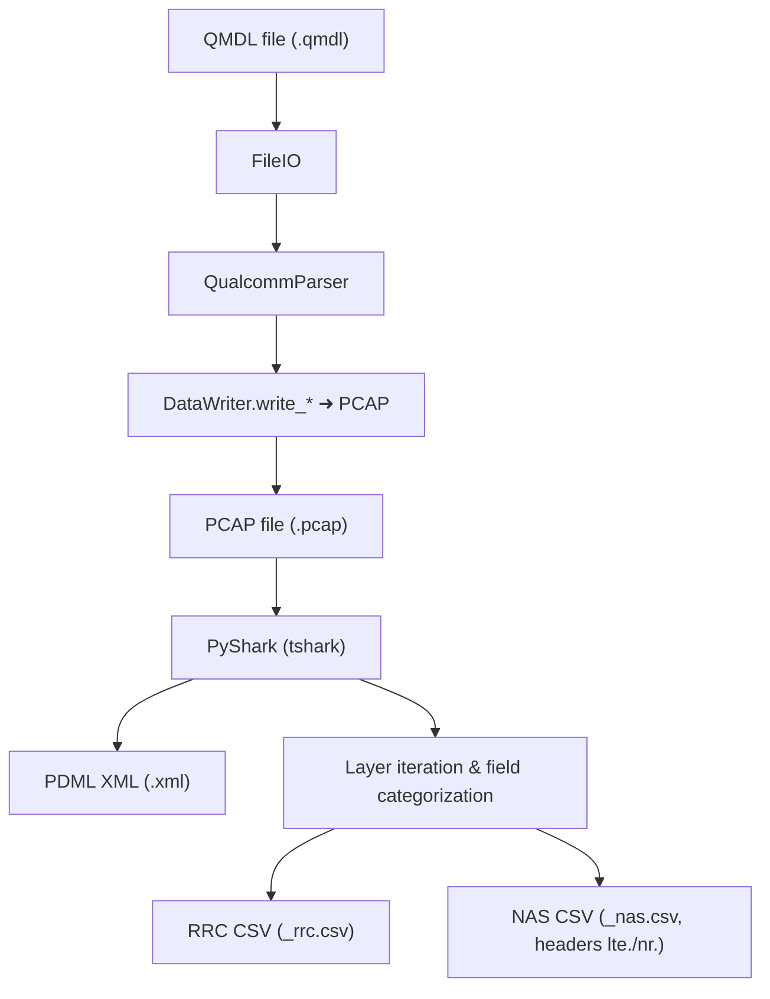
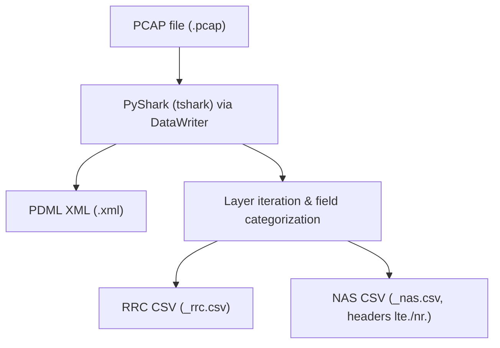

# Mobile Network Signaling Parser - Desktop Version

## Overview

This parser converts QMDL (Qualcomm Diagnostics Log) and PCAP files into XML and CSV formats for cellular network analysis. It supports **permanent PCAP export** alongside CSV and XML output.

## Quick Start

### Setup

```bash
# Create virtual environment
python3 -m venv venv
source venv/bin/activate  # On Windows: venv\Scripts\activate

# Install dependencies
pip install pyshark bitstring pyusb pyserial packaging
```

### Basic Usage

```bash
# Process QMDL file with all outputs (XML, CSV, PCAP)
# Note: -c is a base path; this creates output.csv_rrc.csv and output.csv_nas.csv
python3 qmdl_reader.py diag_log.qmdl -o output.xml -c output.csv -p output.pcap

# Process PCAP file
# Creates output.csv_rrc.csv and output.csv_nas.csv for RRC/NAS data
python3 qmdl_reader.py capture.pcap -o output.xml -c output.csv

# Auto-generate PCAP from CSV path (creates output.pcap from output.csv)
python3 qmdl_reader.py diag_log.qmdl -c output.csv
```

## Key Features

### ✅ Permanent PCAP Export

- **Simultaneous export**: PCAP, CSV, and XML in one operation
- **Auto-generation**: PCAP path generated from CSV path when not specified
- **Flexible output**: Choose which formats to export
- **Backward compatible**: Existing code continues to work

### ✅ Supported Formats

- **Input**: QMDL files, PCAP files
- **Output**: PDML XML, CSV (separate RRC/NAS), PCAP files

### ✅ Protocol Support

- LTE RRC (Radio Resource Control)
- NR RRC (5G Radio Resource Control)
- NAS (Non-Access Stratum)
- GSM protocols
- GSMTAP encapsulation

## Data Flow

### QMDL ➜ PCAP, XML (PDML), and separate RRC/NAS CSV



Notes:

- The `-c` flag is a base path; CSVs are written as `<base>_rrc.csv` and `<base>_nas.csv`.
- NAS CSV headers normalize RAT prefixes: `lte_rrc.*`/`lte-rrc.*` ➜ `lte.*`, `nr_rrc.*`/`nr-rrc.*` ➜ `nr.*`.
- When `-p` is supplied, the PCAP is written as a permanent output.

### PCAP ➜ XML (PDML) and separate RRC/NAS CSV



## Usage Examples

### Export All Formats

```bash
python3 qmdl_reader.py diag_log.qmdl -o analysis.xml -c signals.csv -p capture.pcap
# Produces: signals.csv_rrc.csv and signals.csv_nas.csv
```

### Auto-Generate PCAP Path

```bash
# Creates output.csv_rrc.csv, output.csv_nas.csv and output.pcap
python3 qmdl_reader.py diag_log.qmdl -c output.csv
```

### PCAP Only Export

```bash
python3 qmdl_reader.py diag_log.qmdl -p capture.pcap
```

### Traditional Temporary PCAP (Backward Compatible)

```bash
# Uses temporary PCAP (deleted after processing)
python3 qmdl_reader.py diag_log.qmdl -o output.xml
```

## Command Line Options

```
usage: qmdl_reader.py [-h] [-o OUTPUT] [-c CSV] [-p PCAP] [-s SIZE] input_file

positional arguments:
  input_file            Input QMDL or PCAP file

options:
  -h, --help           show this help message and exit
  -o OUTPUT, --output OUTPUT
                       Output PDML XML file path
  -c CSV, --csv CSV    Output CSV base path (creates <base>_rrc.csv and <base>_nas.csv)
  -p PCAP, --pcap PCAP Output PCAP file path (permanent)
  -s SIZE, --size SIZE  Minimum file size in MB for QMDL files (default: 10)
```

## Output Files

### XML Output (PDML)

- Complete protocol dissection tree
- Wireshark-compatible format
- Detailed field analysis

### CSV Output (RRC and NAS)

- Separate CSV exports: `<base>_rrc.csv` and `<base>_nas.csv`
- RRC CSV: RRC-focused fields (LTE/NR)
- NAS CSV: NAS and GSM A-interface fields
- NAS CSV header normalization: RAT prefixes drop the RRC segment
  - `lte_rrc.*` / `lte-rrc.*` become `lte.*`
  - `nr_rrc.*` / `nr-rrc.*` become `nr.*`
- Packet numbers and timestamps included

### PCAP Output

- Permanent PCAP files (not temporary)
- Compatible with network analysis tools
- Preserves packet structure and timing

## File Structure

```
parser-desktop/
├── qmdl_reader.py          # Main processing script
├── datawriter.py           # Enhanced data writing with PyShark
├── fileio.py               # File input/output handling
├── qualcomm/               # Qualcomm-specific parsers
├── dissector/              # Wireshark dissector files
├── pcap/                   # Sample PCAP files
└── README.md              # This file
```

## Requirements

- **Python**: 3.7+
- **Wireshark**: 2.6.0+ (recommended for 5G support)
- **Memory**: 8GB+ RAM for large files (>1GB)

## Troubleshooting

### Common Issues

**"File too small" Error**

```bash
# Reduce minimum size requirement
python3 qmdl_reader.py small_file.qmdl -s 1 -o output.xml
```

**PyShark Not Available**

```bash
pip install pyshark
```

**No RRC Data in CSV**

- Verify input file contains RRC signaling data
- Check file size and content

## Sample Data

- `pcap/attach_reject.pcap` - Sample PCAP file
- `output-v8.xml` - Example XML output
- `output-v8.csv` - Example CSV output

## Testing

```bash
# Test with sample PCAP file
python3 qmdl_reader.py pcap/attach_reject.pcap -o test.xml -c test.csv -p test.pcap

# Verify outputs
ls -la test.*
```

## License

Part of the SCAT (Signaling Collection and Analysis Tool) project - GPL-2.0-or-later.

## Support

- **Matrix Chat**: #scat-users:tchncs.de
- **Telegram**: @scat_users
- **Issues**: [GitHub Issues](https://github.com/fgsect/scat/issues)
